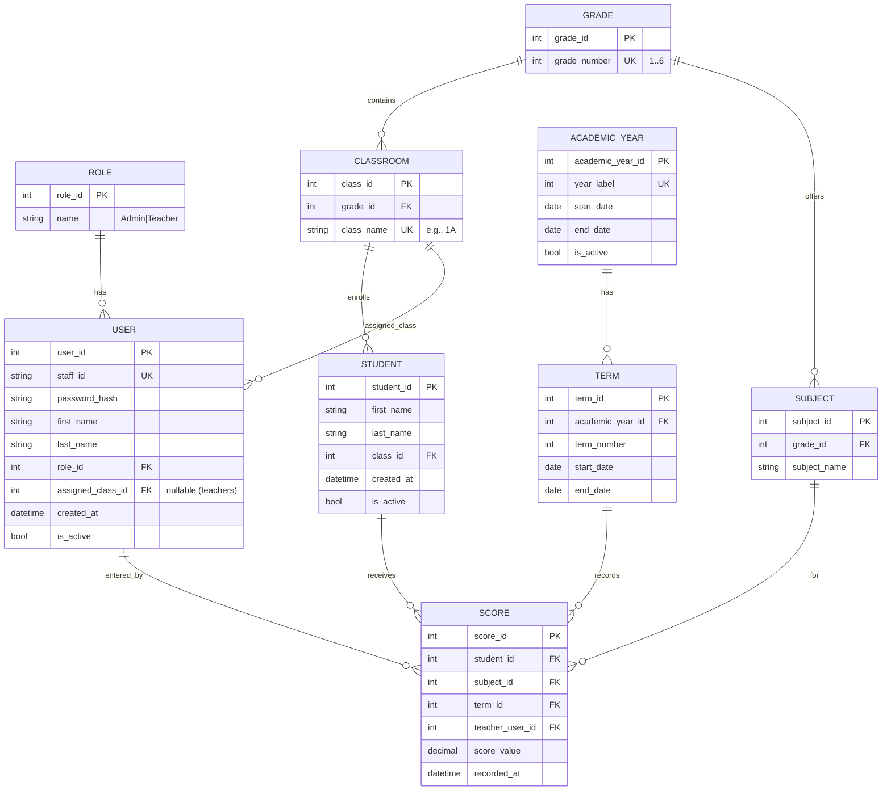

```mermaid
erDiagram
  ROLE ||--o{ USER : has
  GRADE ||--o{ CLASSROOM : contains
  CLASSROOM ||--o{ STUDENT : enrolls
  GRADE ||--o{ SUBJECT : offers
  ACADEMIC_YEAR ||--o{ TERM : has
  TERM ||--o{ SCORE : records
  STUDENT ||--o{ SCORE : receives
  SUBJECT ||--o{ SCORE : for
  USER ||--o{ SCORE : entered_by
  CLASSROOM ||--o{ USER : assigned_class

  ROLE {
    int role_id PK
    string name "Admin|Teacher"
  }

  USER {
    int user_id PK
    string staff_id UK
    string password_hash
    string first_name
    string last_name
    int role_id FK
    int assigned_class_id FK "nullable (teachers)"
    datetime created_at
    bool is_active
  }

  GRADE {
    int grade_id PK
    int grade_number UK "1..6"
  }

  CLASSROOM {
    int class_id PK
    int grade_id FK
    string class_name UK "e.g., 1A"
  }

  STUDENT {
    int student_id PK
    string first_name
    string last_name
    int class_id FK
    datetime created_at
    bool is_active
  }

  SUBJECT {
    int subject_id PK
    int grade_id FK
    string subject_name
  }

  ACADEMIC_YEAR {
    int academic_year_id PK
    int year_label UK
    date start_date
    date end_date
    bool is_active
  }

  TERM {
    int term_id PK
    int academic_year_id FK
    int term_number
    date start_date
    date end_date
  }

  SCORE {
    int score_id PK
    int student_id FK
    int subject_id FK
    int term_id FK
    int teacher_user_id FK
    decimal score_value
    datetime recorded_at
  }


```